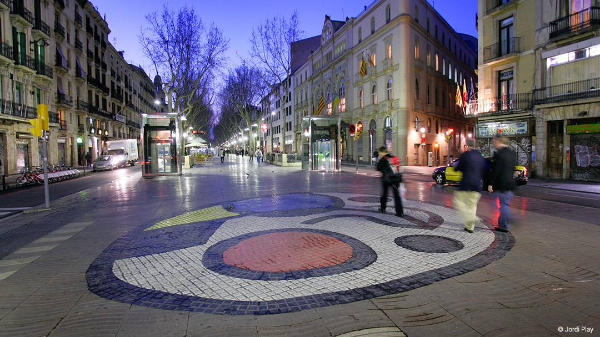
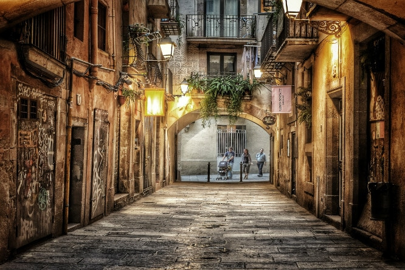
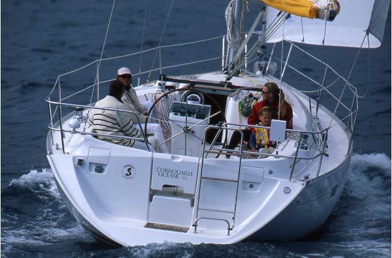
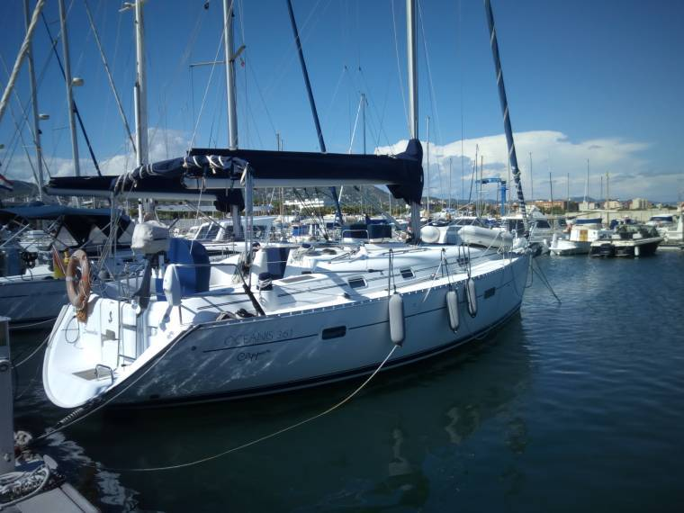
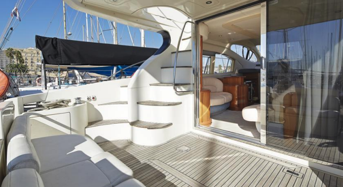

<style>
.list-group-item.active, .list-group-item.active:focus, .list-group-item.active:hover {
    background-color: #EA5933;
}
</style>

<style>
.nav>li>a {
    position: relative;
    display: block;
    padding: 10px 15px;
    color: #EA5933;
    font-weight: bold;
}
.nav-pills>li.active>a, .nav-pills>li.active>a:hover, .nav-pills>li.active>a:focus {
    color: white;
    background-color: #EA5933;
}
</style>


<script> 
    $(document).ready(function() { 
    $head = $('#header'); 
    $head.prepend('<A href = https://www.cuttingedge-events.com></A>') 
    }); 
</script> 


```{r echo=FALSE, message=FALSE,warning=FALSE}
library(readxl)
library(dplyr)
library(knitr)
```

# BARCELONA SIGHTSEEING TOUR

En primer lugar, ofrecemos la opción de una visita de la ciudad de Barcelona en bus. Debido a que una hora y media puede resultar poco, hemos pensado que para poder abarcar una mayor zona de visita, poner un bus para desplazar el grupo de lugar a lugar puede ser una buena opción. En este caso, visitaríamos tres lugares emblemáticos de la ciudad de Barcelona; La Sagrada Familia (sin entrada), Paseo de Grácia/ Plaza Catalunya y la montaña de Montjuic.


<iframe src="https://uploads.knightlab.com/storymapjs/ee2f18a9c1765fc1a4086f419505950c/expanscience-bcn/index.html" frameborder="0" width="99%" height="800"></iframe>

<br>

# TOUR CENTRO HISTÓRICO DE BARCELONA

Como segunda opción como tour, ofrecemos una visita a pie por el "Oldtown" de Barcelona; La Rambla, el barrio Gótico y el barrio del Born.
Se trata de dos barrios diferentes pero que ambos simbolizan la Barcelona antigua, mostrándose así en la arquitectura de los edificios así como en sus calles estrechas y sinuosas. 

El tour empezaría en La Rambla, principal punto de atracción turística, cuya principal zona emblemática es el memorial del atentado terrorista del 19 de agosto de 2017 en Barcelona.



Tras recorrer la Rambla, nuestra guía oficial conducirá al grupo hasta el barrio Gótico. Barrio que se remonta a la edad media, hecho que evidencia sus calles estrechas, plazas sombreadas y hermosa arquitectura (catedrales). Este barrio es una visita obligada si se recorre el centro de la ciudad. 


Por último y después de recorrer el barrio Gótico, nuestra guía oficial compañará al grupo hasta el barrio del Born. También es uno de los barrios más antiguos de Barcelona es también uno de los más de moda. El Born cuenta con calles llenas de carácter repletas de bares de tapas, bares pintorescos y clubes artísticos que le dan a esta zona un ambiente bohemio.



<br>


# ACTIVIDAD EN BARCO {.tabset .tabset-fade .tabset-pills}

Para la actividad en el Barco con snakcs y bebidas proponemos dos opcions diferentes. 
Proporcionamos la opción de velero o yate a motor, dependiendo de las pretenciones e intenciones del cliente. A continuación detallaremos las dos embarcaciones:

## Velero - Hasta 9 pasajeros

Este velero se trata de un Oceanis 361, con capacidad para 9 personas + el patrón, para un total de 10. Se trata de una embarcación con 11 metros de eslora y 4 de manga. 

*Incluye 2/3 bebidas por persona y snacks*






## Yate a motor - Hasta 11 pasajeros

Se trata de un yate a motor con una eslora de 15 metro, manga de 4,5 metros para una capacidad total de 11 personas + tripulación. 

*Incluye 2/3 bebidas por personas y snacks*




# PRESUPUESTO

<iframe src="budgetparainsertar.html" frameborder="0" width="100%" height="1100" scrolling="no"></iframe>

# TÉRMINOS Y CONDICIONES

  * Precios válidos para Grupo Destinos  
  
  * Precios netos para Grupo Destinos
  
  * Precios para un grupo de 7 personas.
  
  * Cutting Edge Events management fee incluido en los precios
  
  * IVA incluido. 
  
  * No se ha hecho reserva. Disponibilidad bajo petición.
  
*****


